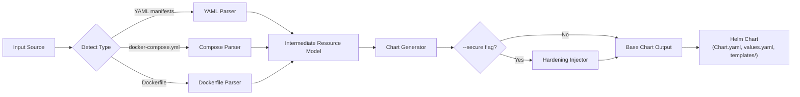
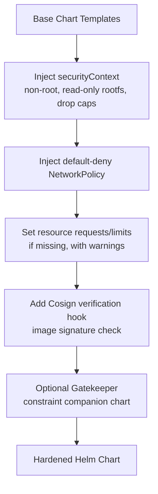

# helmify

**helmify** is a CLI tool that generates production-ready Helm charts from existing project artifacts — raw Kubernetes YAML manifests, `docker-compose.yml` files, or even a bare `Dockerfile`. An optional `--secure` mode layers in CIS-aligned security hardening defaults (non-root contexts, default-deny NetworkPolicies, resource limits, and image signature verification hooks).

> Turn what you already have into a Helm chart you'd actually ship.

---

## Why

Most teams have Kubernetes manifests, a compose file, or just a Dockerfile lying around — but no Helm chart. Hand-writing `Chart.yaml`, `values.yaml`, and templated manifests is repetitive and error-prone, and security hardening is usually an afterthought bolted on later. `helmify` automates the conversion and makes hardening a first-class, opt-in step.

## Core Features

- **Multi-source input** — YAML manifests, docker-compose, or Dockerfile-only
- **Smart templatization** — auto-extracts image tags, replicas, env vars, ports, and resource limits into `values.yaml`
- **Optional `--secure` mode** — injects CIS-aligned `securityContext`, default-deny `NetworkPolicy`, resource requests/limits, and Cosign verification hooks
- **Valid, lint-clean output** — every generated chart passes `helm lint` out of the box
- **Single static binary** — no runtime dependencies

---

## How it works



## Hardening pipeline (`--secure`)



## CLI usage

```bash
# From raw Kubernetes manifests
helmify generate --input ./manifests/ --output ./chart

# From docker-compose
helmify generate --input docker-compose.yml --output ./chart

# From a bare Dockerfile
helmify generate --input Dockerfile --name my-app --output ./chart

# With security hardening
helmify generate --input ./manifests/ --output ./chart --secure
```

---

## Project structure

```
helmify/
├── cmd/
│   └── helmify/            # CLI entrypoint (main.go)
├── internal/
│   ├── parser/
│   │   ├── yaml/           # K8s manifest parser
│   │   ├── compose/        # docker-compose parser
│   │   └── dockerfile/     # Dockerfile introspector
│   ├── generator/          # Chart scaffolding logic (Chart.yaml, values.yaml, templates)
│   ├── hardening/          # --secure mode injectors (CIS defaults)
│   └── templates/          # Base Helm template snippets
├── examples/
│   ├── yaml-input/         # Sample raw manifests + expected output
│   ├── compose-input/      # Sample docker-compose + expected output
│   └── dockerfile-input/   # Sample Dockerfile + expected output
├── docs/                   # Design notes, architecture decisions
├── .github/
│   └── workflows/          # CI: build, test, lint
├── go.mod
└── README.md
```

## Roadmap

| Version | Milestone |
|---------|-----------|
| v0.1 | YAML manifest → Helm chart |
| v0.2 | docker-compose → Helm chart |
| v0.3 | Dockerfile-only → minimal chart scaffold |
| v0.4 | `--secure` flag with CIS hardening injectors |
| v0.5 | `helm lint` integration + auto-generated chart README |
| v1.0 | Polish, full examples, published releases |

## Stack

- **Go** — single static binary, native YAML/K8s tooling, aligns with Helm's own ecosystem
- [Cobra](https://github.com/spf13/cobra) — CLI framework
- `sigs.k8s.io/yaml`, `helm.sh/helm/v3` libraries for chart generation and linting

## License

TBD
