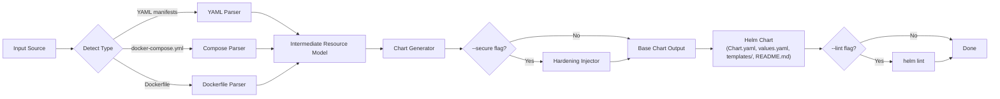
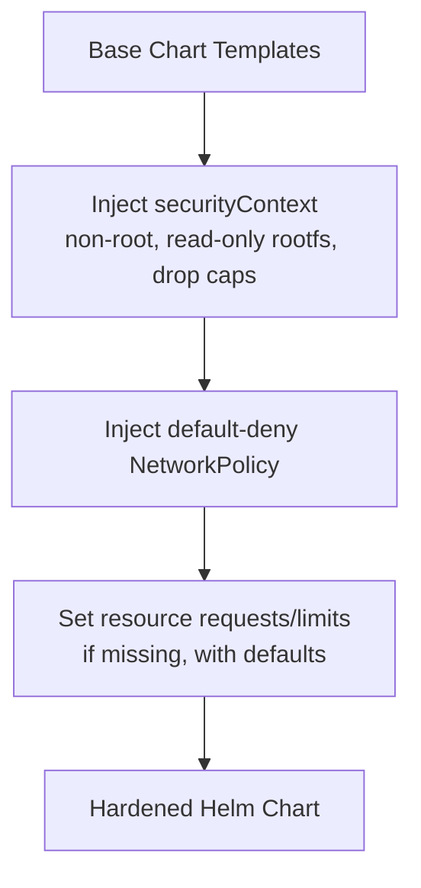

# helmify

**helmify** is a CLI tool that generates production-ready Helm charts from existing project artifacts — raw Kubernetes YAML manifests, `docker-compose.yml` files, or even a bare `Dockerfile`. An optional `--secure` mode layers in CIS-aligned security hardening defaults (non-root contexts, default-deny NetworkPolicies, resource limits), and `--lint` runs `helm lint` on the result automatically.

> Turn what you already have into a Helm chart you'd actually ship.

---

## Status: v1.0

All three input modes are implemented, tested, and pass `helm lint` clean:

| Feature | Status |
|---|---|
| YAML manifests → chart | ✅ |
| docker-compose.yml → chart | ✅ |
| Dockerfile → chart | ✅ |
| `--secure` CIS hardening | ✅ |
| Auto-generated chart README | ✅ |
| `--lint` (runs `helm lint` automatically) | ✅ |

## Why

Most teams have Kubernetes manifests, a compose file, or just a Dockerfile lying around — but no Helm chart. Hand-writing `Chart.yaml`, `values.yaml`, and templated manifests is repetitive and error-prone, and security hardening is usually an afterthought bolted on later. `helmify` automates the conversion and makes hardening a first-class, opt-in step.

## Install

```bash
git clone https://github.com/KADHIRAVANEG/helmify.git
cd helmify
make build
./bin/helmify --help
```

Or install it onto your `$PATH`:

```bash
make install
```

## How it works



## Hardening pipeline (`--secure`)



## CLI usage

```bash
# From raw Kubernetes manifests
helmify generate --input ./manifests/ --output ./chart

# From docker-compose
helmify generate --input docker-compose.yml --output ./chart

# From a bare Dockerfile (only creates a Service if EXPOSE is present)
helmify generate --input Dockerfile --name my-app --output ./chart

# With security hardening and automatic helm lint
helmify generate --input ./manifests/ --output ./chart --secure --lint
```

### Flags

| Flag | Description |
|------|-------------|
| `--input` | Directory of YAML manifests, a `docker-compose.yml`, or a `Dockerfile` |
| `--output` | Output directory for the generated chart (default `./chart`) |
| `--name` | Chart name (defaults to the input's directory name) |
| `--secure` | Apply CIS-aligned hardening (`securityContext`, `NetworkPolicy`, etc.) |
| `--lint` | Run `helm lint` on the generated chart automatically (requires `helm` on PATH) |

### Input-specific notes

- **YAML manifests**: reads every `*.yaml`/`*.yml` in the input directory; supports `Deployment`, `StatefulSet`, `Service`, `ConfigMap`, `Ingress`.
- **docker-compose**: each service becomes a Workload; `deploy.replicas` and `deploy.resources` (limits/reservations) are mapped to Kubernetes replica counts and resource requests/limits; published ports become a `Service`.
- **Dockerfile**: since no built image exists yet, the generated `values.yaml` uses a `REPLACE_ME/<name>` placeholder repository — edit it before deploying. A `Service` is only generated if the Dockerfile declares `EXPOSE`.

## Project structure

```
helmify/
├── cmd/
│   └── helmify/             # CLI entrypoint (main.go)
├── internal/
│   ├── model/                # Shared intermediate representation
│   ├── parser/
│   │   ├── yaml/              # K8s manifest parser
│   │   ├── compose/           # docker-compose parser
│   │   └── dockerfile/        # Dockerfile introspector
│   └── generator/             # Chart scaffolding + templates + README generation
├── examples/
│   ├── yaml-input/            # Sample manifests + generated output
│   ├── compose-input/         # Sample docker-compose + generated output
│   └── dockerfile-input/      # Sample Dockerfile + generated output
├── .github/
│   └── workflows/ci.yml       # Build, vet, smoke-test, helm lint on every push
├── Makefile
├── go.mod
└── README.md
```

## Development

```bash
make build      # compile ./bin/helmify
make examples   # regenerate + lint all example charts (smoke test)
make vet        # go vet
make fmt        # gofmt
make clean      # remove build artifacts and generated example output
```

## Branching model

- `Features` — new functionality and fixes
- `Docs` — documentation-only changes
- `Develop` — integration branch; everything gets merged and tested here first
- `main` — only updated by merging from `Develop` once a milestone is verified

## Roadmap

- [x] v0.1 — YAML manifest → Helm chart
- [x] v0.2 — docker-compose → Helm chart
- [x] v0.3 — Dockerfile-only → minimal chart scaffold
- [x] v0.4 — `--secure` flag with CIS hardening injectors
- [x] v0.5 — auto-generated chart README + `--lint` integration
- [x] v1.0 — Makefile, polished docs, tagged release

Future ideas: Cosign image-signature verification hooks, Gatekeeper constraint companion charts, `helm template` dry-run output, multi-container pod support.

## Stack

- **Go** (stdlib `flag` for CLI — no external CLI framework dependency)
- `gopkg.in/yaml.v3` for YAML parsing

## License

TBD
